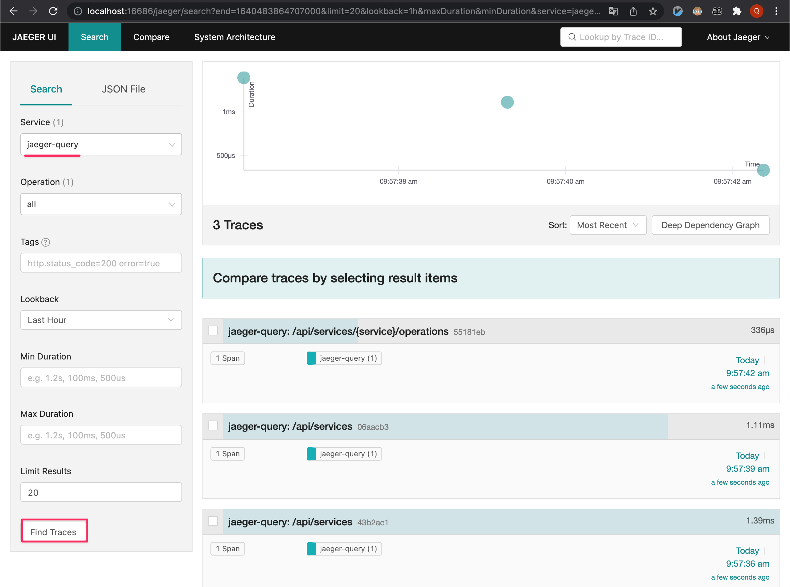
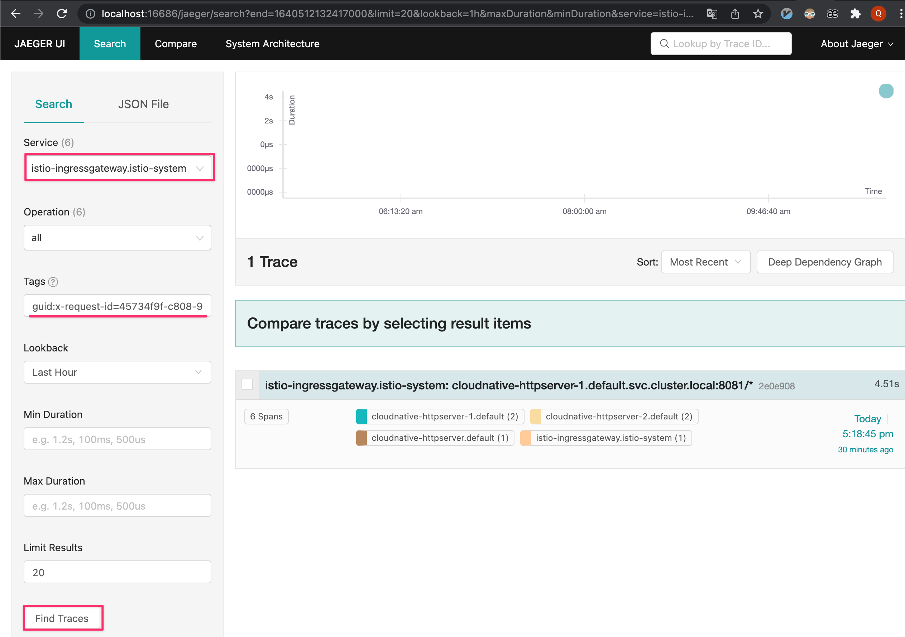
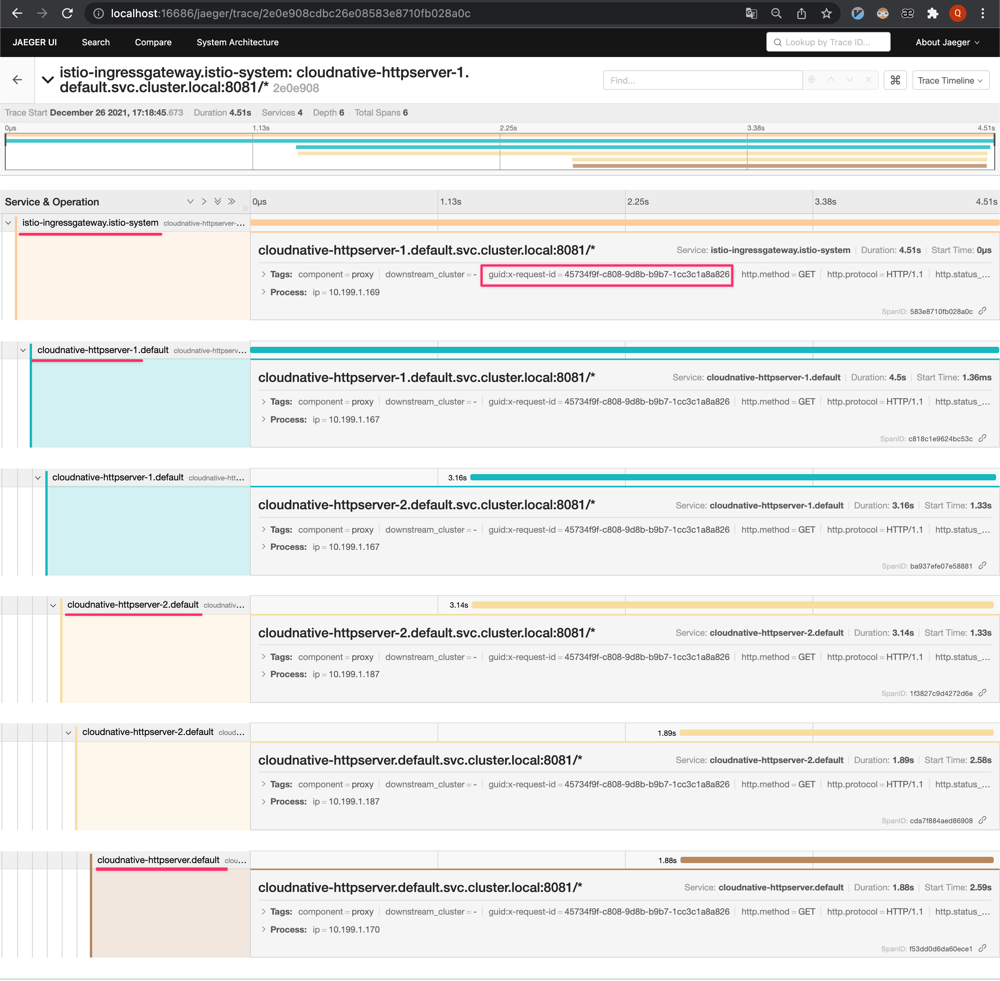

* [模块十二作业](#模块十二作业)
* [准备工作](#准备工作)
   * [istio 安装](#istio-安装)
      * [安装 istio 客户端](#安装-istio-客户端)
      * [安装 istio](#安装-istio)
         * [修改 istio-ingressgateway 的网络模式为 NodePort](#修改-istio-ingressgateway-的网络模式为-nodeport)
         * [确定 Ingress IP 和端口](#确定-ingress-ip-和端口)
      * [简单验证 istio](#简单验证-istio)
   * [部署 链路追踪（OpenTracing）工具](#部署-链路追踪opentracing工具)
      * [安装 jaeger](#安装-jaeger)
      * [简单验证 jaeger](#简单验证-jaeger)
* [作业](#作业)
   * [httpserver 的改造](#httpserver-的改造)
   * [配置清单 的改造](#配置清单-的改造)
   * [启动服务](#启动服务)
      * [构建镜像](#构建镜像)
      * [启用 istio 注入](#启用-istio-注入)
      * [创建 证书](#创建-证书)
      * [创建3个 httpserver 服务](#创建3个-httpserver-服务)
      * [创建 istio 网关及虚拟服务](#创建-istio-网关及虚拟服务)
      * [测试 http、https 访问](#测试-httphttps-访问)
         * [测试普通 http 访问](#测试普通-http-访问)
         * [测试普通 https 访问](#测试普通-https-访问)
   * [测试 open tracing 功能](#测试-open-tracing-功能)
      * [查看链路追踪记录](#查看链路追踪记录)
      * [httpserver-1](#httpserver-1)
      * [httpserver-2](#httpserver-2)
      * [httpserver](#httpserver)
* [总结](#总结)
   * [如何实现安全保证](#如何实现安全保证)
   * [七层路由规则](#七层路由规则)
   * [考虑 open tracing 的接入](#考虑-open-tracing-的接入)

# 模块十二作业
把我们的 httpserver 服务以 Istio Ingress Gateway 的形式发布出来。以下是你需要考虑的几点：

* 如何实现安全保证；    -> [给 GateWay 配置 tls](#如何实现安全保证)
* 七层路由规则；        -> [给 VirtualService 添加 rewrite 配置](#七层路由规则)
* 考虑 open tracing 的接入。  -> [测试 open tracing 功能](#测试-open-tracing-功能)

# 准备工作
想完成本次作业，需要提前部署[`istio`](https://istio.io/latest/docs/setup/getting-started/)以及[`jaeger`](https://www.jaegertracing.io/docs/1.29/getting-started/)。<br>
另外，k8s 也是必不可少的。

## istio 安装
参考官方文档：[使用 Istioctl 安装](https://istio.io/latest/zh/docs/setup/install/istioctl/)<br>
这里使用 istioctl 工具安装，该工具通过`brew`安装。<br>

#### 安装 istio 客户端
```
$ brew install istioctl
$ istioctl version

client version: 1.12.1
control plane version: 1.12.1
data plane version: 1.12.1 (2 proxies)
```

#### 安装 istio
```
$ istioctl install --set profile=demo -y

✔ Istio core installed
✔ Istiod installed
✔ Ingress gateways installed
✔ Egress gateways installed
✔ Installation complete

$ kubectl get pods -n istio-system

NAME                                   READY   STATUS    RESTARTS   AGE
istio-egressgateway-8548c579b8-hsqj4   1/1     Running   0          5m29s
istio-ingressgateway-ddf94cd8d-g8ngz   1/1     Running   0          5m29s
istiod-7476c87948-jztgl                1/1     Running   0          6m6s
```

##### 修改 istio-ingressgateway 的网络模式为 NodePort
本环境没有 LoadBalancer，所以将默认的 svc 切换为 NodePort 方式。
```
$ kubectl -n istio-system patch service istio-ingressgateway -p '{"spec": {"type": "NodePort"}}'
$ kubectl get svc -n istio-system

NAME                   TYPE        CLUSTER-IP       EXTERNAL-IP   PORT(S)                                                                      AGE
istio-egressgateway    ClusterIP   10.106.86.187    <none>        80/TCP,443/TCP                                                               9m6s
istio-ingressgateway   NodePort    10.100.181.120   <none>        15021:30417/TCP,80:30185/TCP,443:32072/TCP,31400:30510/TCP,15443:30129/TCP   9m6s
istiod                 ClusterIP   10.104.178.212   <none>        15010/TCP,15012/TCP,443/TCP,15014/TCP                                        9m44s
```

##### 确定 Ingress IP 和端口
> 参考官方文档：[Ingress Gateway](https://istio.io/latest/zh/docs/tasks/traffic-management/ingress/ingress-control/)

设置 Ingress 端口：
```
$ export INGRESS_HOST=$(kubectl get po -l istio=ingressgateway -n istio-system -o jsonpath='{.items[0].status.hostIP}')
$ export INGRESS_PORT=$(kubectl -n istio-system get service istio-ingressgateway -o jsonpath='{.spec.ports[?(@.name=="http2")].nodePort}')
$ export SECURE_INGRESS_PORT=$(kubectl -n istio-system get service istio-ingressgateway -o jsonpath='{.spec.ports[?(@.name=="https")].nodePort}')
$ export TCP_INGRESS_PORT=$(kubectl -n istio-system get service istio-ingressgateway -o jsonpath='{.spec.ports[?(@.name=="tcp")].nodePort}')
$ echo "INGRESS_HOST:${INGRESS_HOST} INGRESS_PORT:${INGRESS_PORT} SECURE_INGRESS_PORT:${SECURE_INGRESS_PORT} TCP_INGRESS_PORT:${TCP_INGRESS_PORT}"

INGRESS_HOST:192.168.130.63 INGRESS_PORT:30185 SECURE_INGRESS_PORT:32072 TCP_INGRESS_PORT:30510
```

#### 简单验证 istio
使用`curl`访问`istio`看返回结果。

```
$ curl -v http://${INGRESS_HOST}:${INGRESS_PORT}

* Uses proxy env variable http_proxy == 'http://127.0.0.1:6152'
*   Trying 127.0.0.1:6152...
* Connected to 127.0.0.1 (127.0.0.1) port 6152 (#0)
> GET http://192.168.130.63:30185/ HTTP/1.1
> Host: 192.168.130.63:30185
> User-Agent: curl/7.77.0
> Accept: */*
> Proxy-Connection: Keep-Alive
>
* Mark bundle as not supporting multiuse
< HTTP/1.1 404 Not Found
< Date: Sun, 26 Dec 2021 02:39:43 GMT
< Server: istio-envoy
< Content-Length: 0
< X-Cache: MISS from dev-jump
< X-Cache-Lookup: MISS from dev-jump:52975
< Via: 1.1 dev-jump (squid/3.5.20)
< Connection: keep-alive
<
* Connection #0 to host 127.0.0.1 left intact
```

说明 istio 的 ingressgateway 是可以正常访问的，由于没有后端路由规则，所以返回了 404 错误。

## 部署 链路追踪（OpenTracing）工具
由于作业需要考虑 open tracing 的接入，所以需要有数据采集服务器。这里以 jaeger 为例。

#### 安装 jaeger
安装方式可以参考官方文档：[Getting Started](https://www.jaegertracing.io/docs/1.29/getting-started/)<br>
我这里偷懒，借用老师的 [yaml](https://raw.githubusercontent.com/cncamp/101/0d4d62397ea0785830123270d909b0aed62cc9cb/module12/istio/tracing/jaeger.yaml) 来部署。<br>

```
$ kubectl apply -f https://raw.githubusercontent.com/cncamp/101/0d4d62397ea0785830123270d909b0aed62cc9cb/module12/istio/tracing/jaeger.yaml

deployment.apps/jaeger created
service/tracing created
service/zipkin created
service/jaeger-collector created
```

#### 简单验证 jaeger
借助`istioctl`可以很方便的配置好端口转发，在本地访问`jaeger`服务。
```
$ istioctl dashboard jaeger

http://localhost:16686
```

效果图：

# 作业

## httpserver 的改造

* 增加了路由规则`/call-next-service/*`
  * 该路由会调用下游服务，服务地址来源于环境变量`NEXT_SERVICE_ADDR`。

* 增加了环境变量`NEXT_SERVICE_ADDR`
  * 这样使用同一个镜像，让不同服务请求不同的下游地址。

* 返回结果中打印了环境变量`VERSION`的值。
  * 便于知道是哪个服务返回的

## 配置清单 的改造
* 调整原[`cloudnative-httpserver`](./deployment.yaml)

  将镜像替换成最新版本，并将环境变量的`VERSION`改为了：`v2.1.0-service-finally`。

* 新增[`cloudnative-httpserver-1` 及 `cloudnative-httpserver-2`](./deployment-service-1-2.yaml)

  `cloudnative-httpserver-1` 环境变量：<br>
    * `VERSION`配置为了：`v2.1.0-service-1`<br>
    * `NEXT_SERVICE_ADDR`配置为了：`http://cloudnative-httpserver-2:8081/call-next-service/from-service-1`<br>

  `cloudnative-httpserver-2` 环境变量：<br>
    * `VERSION`配置为了：`v2.1.0-service-2`<br>
    * `NEXT_SERVICE_ADDR`配置为了：`http://cloudnative-httpserver:8081/from-service-2`<br>

* 新增 Istio 相关配置 [`Gateway` `VirtualService`](./istio-specs.yaml)

  一个是 http 的配置，另外一个是 https 的配置。<br>
  其中 http 的虚拟服务器配置了一个 rewrite 匹配规则，便于验证 7层路由规则。后面会具体附上用例。<br>

## 启动服务
### 构建镜像
```
$ VERSION=2.1.0 make build push

docker build --build-arg version=v2.1.0 . -t 190219044/httpserver:2.1.0
...
docker push 190219044/httpserver:2.1.0
```

### 启用 istio 注入
```
$ kubectl label namespace default istio-injection=enabled
```

### 创建 证书
> *注意:*
> 在[`deployment.yaml`](./deployment.yaml)中的 tls 凭据是 ingress 使用的。<br>
> istio 的 `Gateway` 只认 `istio-system` 下的证书。

创建 TLS 证书 便于 ingress 及 istio 使用。
```
$ openssl req -x509 -sha256 -nodes -days 365 -newkey rsa:2048 \
    -out foo-ingress-tls.crt \
    -keyout foo-ingress-tls.key \
    -subj "/CN=*.bar.com/O=test Inc"

$ kubectl delete -n istio-system secret foo-ingress-tls
$ kubectl create -n istio-system secret tls foo-ingress-tls \
    --key foo-ingress-tls.key \
    --cert foo-ingress-tls.crt

```
### 创建3个 httpserver 服务
```
$ kubectl apply -n default -f deployment.yaml
$ kubectl apply -n default -f deployment-service-1-2.yaml
```
### 创建 istio 网关及虚拟服务
```
$ kubectl apply -n default -f istio-specs.yaml
```

### 测试 http、https 访问
> 需要使用上面的语句设置相关环境变量：INGRESS_PORT、INGRESS_HOST等。
```
$ export INGRESS_HOST=$(kubectl get po -l istio=ingressgateway -n istio-system -o jsonpath='{.items[0].status.hostIP}')
$ export INGRESS_PORT=$(kubectl -n istio-system get service istio-ingressgateway -o jsonpath='{.spec.ports[?(@.name=="http2")].nodePort}')
$ export SECURE_INGRESS_PORT=$(kubectl -n istio-system get service istio-ingressgateway -o jsonpath='{.spec.ports[?(@.name=="https")].nodePort}')
$ export TCP_INGRESS_PORT=$(kubectl -n istio-system get service istio-ingressgateway -o jsonpath='{.spec.ports[?(@.name=="tcp")].nodePort}')
```

#### 测试普通 http 访问
```
$ curl -v --resolve foo.bar.com:${INGRESS_PORT}:${INGRESS_HOST} http://foo.bar.com:${INGRESS_PORT}/hello

* Added foo.bar.com:30185:192.168.130.63 to DNS cache
* Hostname foo.bar.com was found in DNS cache
*   Trying 192.168.130.63:30185...
* Connected to foo.bar.com (192.168.130.63) port 30185 (#0)
> GET /hello HTTP/1.1
> Host: foo.bar.com:30185
> User-Agent: curl/7.80.0
> Accept: */*
>
* Mark bundle as not supporting multiuse
< HTTP/1.1 200 OK
< accept: */*
< content-type: application/json; charset=utf-8
< user-agent: curl/7.80.0
< version: v2.1.0-service-1
< x-b3-parentspanid: 964e4b2d3e2ae458
< x-b3-sampled: 1
< x-b3-spanid: 585bb575d218a6d9
< x-b3-traceid: 6f45ff04c823d901964e4b2d3e2ae458
< x-envoy-attempt-count: 1
< x-envoy-external-address: 100.64.0.2
< x-forwarded-client-cert: By=spiffe://cluster.local/ns/default/sa/default;Hash=b0f8a3a8720e476c64eb4dc3e90ca66a40f10aab62186ead02e40de6beaca375;Subject="";URI=spiffe://cluster.local/ns/istio-system/sa/istio-ingressgateway-service-account
< x-forwarded-for: 100.64.0.2
< x-forwarded-proto: http
< x-request-id: d81a8484-ce75-9617-8113-612c04585b4b
< date: Sun, 26 Dec 2021 07:14:17 GMT
< content-length: 37
< x-envoy-upstream-service-time: 1199
< server: istio-envoy
<
* Connection #0 to host foo.bar.com left intact
{"hello":"world","usedtime":"1.175s","version":"v2.1.0-service-1"}
```

通过返回的信息，可以知道是`cloudnative-httpserver-1`服务返回的。

#### 测试普通 https 访问
```
$ curl --insecure -ipv4 --resolve foo.bar.com:${SECURE_INGRESS_PORT}:${INGRESS_HOST} https://foo.bar.com:${SECURE_INGRESS_PORT}

* Added foo.bar.com:32072:192.168.130.63 to DNS cache
* Hostname foo.bar.com was found in DNS cache
*   Trying 192.168.130.63:32072...
* Connected to foo.bar.com (192.168.130.63) port 32072 (#0)
* Initializing NSS with certpath: sql:/etc/pki/nssdb
*  CAfile: none
*  CApath: none
* loaded libnssckbi.so
* skipping SSL peer certificate verification
* ALPN, server accepted to use h2
* SSL connection using TLS_AES_128_GCM_SHA256
* Server certificate:
* subject: O=test Inc,CN=*.bar.com
*  start date: Dec 26 11:44:51 2021 GMT
*  expire date: Dec 26 11:44:51 2022 GMT
*  common name: *.bar.com
*  issuer: O=test Inc,CN=*.bar.com
* Using HTTP2, server supports multiplexing
* Connection state changed (HTTP/2 confirmed)
* Copying HTTP/2 data in stream buffer to connection buffer after upgrade: len=0
* Using Stream ID: 1 (easy handle 0x24594e0)
> GET / HTTP/2
> Host: foo.bar.com:32072
> user-agent: curl/7.80.0
> accept: */*
>
* Connection state changed (MAX_CONCURRENT_STREAMS == 2147483647)!
< HTTP/2 200
HTTP/2 200
< accept: */*
accept: */*
< content-type: application/json; charset=utf-8
content-type: application/json; charset=utf-8
< user-agent: curl/7.80.0
user-agent: curl/7.80.0
< version: v2.1.0-service-1
version: v2.1.0-service-1
< x-b3-parentspanid: cdd5d0d9854e8be9
x-b3-parentspanid: cdd5d0d9854e8be9
< x-b3-sampled: 1
x-b3-sampled: 1
< x-b3-spanid: d36da1cec2468969
x-b3-spanid: d36da1cec2468969
< x-b3-traceid: cfe400b825692037cdd5d0d9854e8be9
x-b3-traceid: cfe400b825692037cdd5d0d9854e8be9
< x-envoy-attempt-count: 1
x-envoy-attempt-count: 1
< x-envoy-external-address: 100.64.0.2
x-envoy-external-address: 100.64.0.2
< x-forwarded-client-cert: By=spiffe://cluster.local/ns/default/sa/default;Hash=b0f8a3a8720e476c64eb4dc3e90ca66a40f10aab62186ead02e40de6beaca375;Subject="";URI=spiffe://cluster.local/ns/istio-system/sa/istio-ingressgateway-service-account
x-forwarded-client-cert: By=spiffe://cluster.local/ns/default/sa/default;Hash=b0f8a3a8720e476c64eb4dc3e90ca66a40f10aab62186ead02e40de6beaca375;Subject="";URI=spiffe://cluster.local/ns/istio-system/sa/istio-ingressgateway-service-account
< x-forwarded-for: 100.64.0.2
x-forwarded-for: 100.64.0.2
< x-forwarded-proto: https
x-forwarded-proto: https
< x-request-id: bd962582-413e-92a2-b605-20dbfe66706e
x-request-id: bd962582-413e-92a2-b605-20dbfe66706e
< date: Sun, 26 Dec 2021 11:48:15 GMT
date: Sun, 26 Dec 2021 11:48:15 GMT
< content-length: 66
content-length: 66
< x-envoy-upstream-service-time: 1061
x-envoy-upstream-service-time: 1061
< server: istio-envoy
server: istio-envoy

<
* Connection #0 to host foo.bar.com left intact
{"hello":"world","usedtime":"1.058s","version":"v2.1.0-service-1"}
```

> 如果在 `Gateway` 中用到的 tls 证书不在 `istio-system` 命名空间下，就会遇到如下错误：<br>
> 即使这样处理了，问题依旧：[cURL SSL connect error 35 with NSS error -5961](https://stackoverflow.com/questions/21887315/curl-ssl-connect-error-35-with-nss-error-5961)<br>
```
$ curl -k -v https://10.100.181.120:443

*   Trying 10.100.181.120:443...
* Connected to 10.100.181.120 (10.100.181.120) port 443 (#0)
* Initializing NSS with certpath: sql:/etc/pki/nssdb
*  CAfile: none
*  CApath: none
* loaded libnssckbi.so
* NSS error -5961 (PR_CONNECT_RESET_ERROR)
* TCP connection reset by peer
* Closing connection 0
curl: (35) TCP connection reset by peer
```

## 测试 open tracing 功能
我这里用 http 演示链路追踪功能。<br>
预期的请求路径是：client -> istio ingressgateway -> cloudnative-httpserver-1 -> cloudnative-httpserver-2 -> cloudnative-httpserver

整体流程是：<br>
* cloudnative-httpserver-1: 接收到 URL 为`/call-next-service/service-1`请求
  * 调用 cloudnative-httpserver-2 服务
* cloudnative-httpserver-2: 接收到 URL 为`/call-next-service/from-service-1`请求
  * 调用 cloudnative-httpserver 服务
* cloudnative-httpserver: 接收到 URL 为`/from-service-2`请求
  * 返回内容带有 `"version":"v2.1.0-service-finally"` 的结果

测试脚本及返回结果如下：
```
$ curl -v --resolve foo.bar.com:${INGRESS_PORT}:${INGRESS_HOST} http://foo.bar.com:${INGRESS_PORT}/call-next-service/service-1

* Added foo.bar.com:30185:192.168.130.63 to DNS cache
* Hostname foo.bar.com was found in DNS cache
*   Trying 192.168.130.63:30185...
* Connected to foo.bar.com (192.168.130.63) port 30185 (#0)
> GET /call-next-service/service-1 HTTP/1.1
> Host: foo.bar.com:30185
> User-Agent: curl/7.80.0
> Accept: */*
>
* Mark bundle as not supporting multiuse
< HTTP/1.1 200 OK
< version: v2.1.0-service-1
< date: Sun, 26 Dec 2021 09:18:50 GMT
< content-length: 1154
< content-type: text/plain; charset=utf-8
< x-envoy-upstream-service-time: 4509
< server: istio-envoy
<
HTTP/1.1 200 OK
Content-Length: 957
Content-Type: text/plain; charset=utf-8
Date: Sun, 26 Dec 2021 09:18:50 GMT
Server: envoy
Version: v2.1.0-service-2
X-Envoy-Upstream-Service-Time: 3159

HTTP/1.1 200 OK
Content-Length: 72
Accept: */*
Accept-Encoding: gzip,gzip
Content-Type: application/json; charset=utf-8
Date: Sun, 26 Dec 2021 09:18:50 GMT
Server: envoy
User-Agent: Go-http-client/1.1,Go-http-client/1.1,curl/7.80.0
Version: v2.1.0-service-finally
Version-Configmap: 1.0.1-configmap
Version-Secret: 1.0.1-secret
X-B3-Parentspanid: cda7f884aed86908
X-B3-Sampled: 1
X-B3-Spanid: f53dd0d6da60ece1
X-B3-Traceid: 2e0e908cdbc26e08583e8710fb028a0c
X-Envoy-Attempt-Count: 1
X-Envoy-External-Address: 100.64.0.2
X-Envoy-Upstream-Service-Time: 1890
X-Forwarded-Client-Cert: By=spiffe://cluster.local/ns/default/sa/default;Hash=61bf674b2abbcccb616ac385b1980668b0aceb6d87da53f0bddab7f194742988;Subject="";URI=spiffe://cluster.local/ns/default/sa/default
X-Forwarded-For: 100.64.0.2
X-Forwarded-Proto: http
X-Request-Id: 45734f9f-c808-9d8b-b9b7-1cc3c1a8a826

* Connection #0 to host foo.bar.com left intact
{"hello":"world","usedtime":"1.872s","version":"v2.1.0-service-finally"}
```

通过返回的信息`"version":"v2.1.0-service-finally"`，可以知道是`cloudnative-httpserver`服务返回的。<br>

#### 查看链路追踪记录
打开 jaeger 的界面，看是否有本次请求的链路追踪记录。
```
$ istioctl dashboard jaeger

http://localhost:16686
```
配置请求参数：(通过上面 curl 的日志可以看到请求唯一编号：guid:x-request-id=45734f9f-c808-9d8b-b9b7-1cc3c1a8a826)


查看详细请求记录：



另外，可以看下3个Pod的日志，验证请求是否按预期在传递。
#### httpserver-1
```
$ kubectl logs -f -n default -l app=cloudnative-httpserver-1

I1226 09:18:45.675901       1 main.go:240] "entering `call next service` handler" any="/service-1"
I1226 09:18:46.995073       1 main.go:245] ===================Details of the http request header:============
I1226 09:18:46.995659       1 main.go:254] "headers:" map[accept:[*/*] user-agent:[curl/7.80.0] x-b3-parentspanid:[583e8710fb028a0c] x-b3-sampled:[1] x-b3-spanid:[c818c1e9624bc53c] x-b3-traceid:[2e0e908cdbc26e08583e8710fb028a0c] x-envoy-attempt-count:[1] x-envoy-external-address:[100.64.0.2] x-forwarded-client-cert:[By=spiffe://cluster.local/ns/default/sa/default;Hash=b0f8a3a8720e476c64eb4dc3e90ca66a40f10aab62186ead02e40de6beaca375;Subject="";URI=spiffe://cluster.local/ns/istio-system/sa/istio-ingressgateway-service-account] x-forwarded-for:[100.64.0.2] x-forwarded-proto:[http] x-request-id:[45734f9f-c808-9d8b-b9b7-1cc3c1a8a826]]="(MISSING)"
I1226 09:18:50.176221       1 main.go:261] "HTTP get succeeded"
I1226 09:18:50.176457       1 main.go:266] Respond in 1.319s
127.0.0.6 - [Sun, 26 Dec 2021 09:18:50 UTC] "GET /call-next-service/service-1 HTTP/1.1 200 4.500651529s "curl/7.80.0" "
[GIN] 2021/12/26 - 09:18:50 | 200 |  4.501622227s |       127.0.0.6 | GET      "/call-next-service/service-1"
```

#### httpserver-2
```
$ kubectl logs -f -n default -l app=cloudnative-httpserver-2

I1226 09:18:47.009354       1 main.go:240] "entering `call next service` handler" any="/from-service-1"
I1226 09:18:48.251785       1 main.go:245] ===================Details of the http request header:============
I1226 09:18:48.252186       1 main.go:254] "headers:" map[accept:[*/*] accept-encoding:[gzip] user-agent:[Go-http-client/1.1,curl/7.80.0] x-b3-parentspanid:[ba937efe07e58881] x-b3-sampled:[1] x-b3-spanid:[1f3827c9d4272d6e] x-b3-traceid:[2e0e908cdbc26e08583e8710fb028a0c] x-envoy-attempt-count:[1] x-envoy-external-address:[100.64.0.2] x-forwarded-client-cert:[By=spiffe://cluster.local/ns/default/sa/default;Hash=7266bbfc66f6c1333e55283d16da2b70699a57bf30b5b95a1f4f695689f9181a;Subject="";URI=spiffe://cluster.local/ns/default/sa/default] x-forwarded-for:[100.64.0.2] x-forwarded-proto:[http] x-request-id:[45734f9f-c808-9d8b-b9b7-1cc3c1a8a826]]="(MISSING)"
I1226 09:18:50.147934       1 main.go:261] "HTTP get succeeded"
I1226 09:18:50.148109       1 main.go:266] Respond in 1.242s
127.0.0.6 - [Sun, 26 Dec 2021 09:18:50 UTC] "GET /call-next-service/from-service-1 HTTP/1.1 200 3.13884836s "Go-http-client/1.1,curl/7.80.0" "
[GIN] 2021/12/26 - 09:18:50 | 200 |  3.138946073s |       127.0.0.6 | GET      "/call-next-service/from-service-1"
```

#### httpserver
```
$ kubectl logs -f -n default -l app=cloudnative-httpserver

I1226 09:18:50.135507       1 main.go:188] ---body/---
I1226 09:18:50.135555       1 main.go:189] ---header/---
I1226 09:18:50.135621       1 main.go:191] "Header" Accept=[*/*]
I1226 09:18:50.135641       1 main.go:191] "Header" X-Envoy-Attempt-Count=[1]
I1226 09:18:50.135661       1 main.go:191] "Header" X-Forwarded-Client-Cert=[By=spiffe://cluster.local/ns/default/sa/default;Hash=61bf674b2abbcccb616ac385b1980668b0aceb6d87da53f0bddab7f194742988;Subject="";URI=spiffe://cluster.local/ns/default/sa/default]
I1226 09:18:50.135697       1 main.go:191] "Header" X-B3-Spanid=[f53dd0d6da60ece1]
I1226 09:18:50.135707       1 main.go:191] "Header" X-B3-Sampled=[1]
I1226 09:18:50.135728       1 main.go:191] "Header" User-Agent=[Go-http-client/1.1,Go-http-client/1.1,curl/7.80.0]
I1226 09:18:50.137214       1 main.go:191] "Header" X-Forwarded-For=[100.64.0.2]
I1226 09:18:50.139191       1 main.go:191] "Header" Accept-Encoding=[gzip,gzip]
I1226 09:18:50.139224       1 main.go:191] "Header" X-Envoy-External-Address=[100.64.0.2]
I1226 09:18:50.139235       1 main.go:191] "Header" X-Request-Id=[45734f9f-c808-9d8b-b9b7-1cc3c1a8a826]
I1226 09:18:50.139245       1 main.go:191] "Header" X-B3-Parentspanid=[cda7f884aed86908]
I1226 09:18:50.139289       1 main.go:191] "Header" X-Forwarded-Proto=[http]
I1226 09:18:50.139305       1 main.go:191] "Header" X-B3-Traceid=[2e0e908cdbc26e08583e8710fb028a0c]
127.0.0.6 - [Sun, 26 Dec 2021 09:18:50 UTC] "GET /from-service-2 HTTP/1.1 200 1.879653254s "Go-http-client/1.1,Go-http-client/1.1,curl/7.80.0" "
```

# 总结
## 如何实现安全保证

  参考官方文档：[Secure Gateways](https://preliminary.istio.io/latest/zh/docs/tasks/traffic-management/ingress/secure-ingress/)<br>
  这里只展示了 "配置单机TLS入口网关" 的方式，通过给 `Gateway` 配置 tls 的方式，来保证安全。<br>
```
apiVersion: networking.istio.io/v1beta1
kind: Gateway
metadata:
  name: httpsserver
spec:
  selector:
    istio: ingressgateway
  servers:
    - hosts:
        # - "*"
        - foo.bar.com
      port:
        name: https
        number: 443
        protocol: HTTPS
      tls:
        mode: SIMPLE
        credentialName: foo-ingress-tls
```

  如果有更高的安全要求，可以参考:"配置双向 TLS 入口网关"。<br>
  也可以参考官方文档：[Ingress Gateway without TLS Termination](https://preliminary.istio.io/latest/zh/docs/tasks/traffic-management/ingress/ingress-sni-passthrough/)<br>
  `Gatewawy` 通过 `PASSTHROUGH` 穿透的方式，将加密流量直接转发给后端服务，由具体的后端服务来保证安全。

## 七层路由规则

  可以在 `VirtualService` 中配置具体的转发规则。<br>
  比如下面就将 `http://foo.bar.com/rewrite/call-next-service/hello` 的请求转发给了 `http://cloudnative-httpserver-1.default.svc.cluster.local:8081/call-next-service/hello`
```
apiVersion: networking.istio.io/v1beta1
kind: VirtualService
metadata:
  name: httpserver
spec:
  gateways:
    - httpserver
  hosts:
    - foo.bar.com
  http:
    - match:
      - uri:
          exact: "/rewrite/call-next-service/hello"
      rewrite:
        uri: "/call-next-service/hello"
      route:
        - destination:
            host: cloudnative-httpserver-1.default.svc.cluster.local
            port:
              number: 8081
    - match:
        - port: 80
      route:
        - destination:
            host: cloudnative-httpserver-1.default.svc.cluster.local
            port:
              number: 8081
```

  我们可以验证一下：
```
# 没有匹配上 rewrite 转发规则
# 流量并没有被交给下游服务，而是由 cloudnative-httpserver-1 直接返回。
$ curl --resolve foo.bar.com:${INGRESS_PORT}:${INGRESS_HOST} http://foo.bar.com:${INGRESS_PORT}/rewrite/call-next-service/test

{"hello":"world","usedtime":"418ms","version":"v2.1.0-service-1"}


# 匹配上了 rewrite 转发规则
# 流量被交给下游服务，最终由 cloudnative-httpserver 返回。
$ curl --resolve foo.bar.com:${INGRESS_PORT}:${INGRESS_HOST} http://foo.bar.com:${INGRESS_PORT}/rewrite/call-next-service/hello

{"hello":"world","usedtime":"878ms","version":"v2.1.0-service-finally"}
```

## 考虑 open tracing 的接入
  这里是完全依赖了 istio 注入的请求头。<br>
  然后在请求下游服务时，将唯一的请求ID `x-request-id`带上，以便 jaeger 能串联起各组件。<br>
  详见上面的 [测试 open tracing 功能](#测试-open-tracing-功能)

  如果请求链路中还有类似于 kafka 的中间件，则需要将相关请求头也存入 kafka，在消费端取出该请求头，并记录到后续的请求日志中。这样才能串起整个链路。

